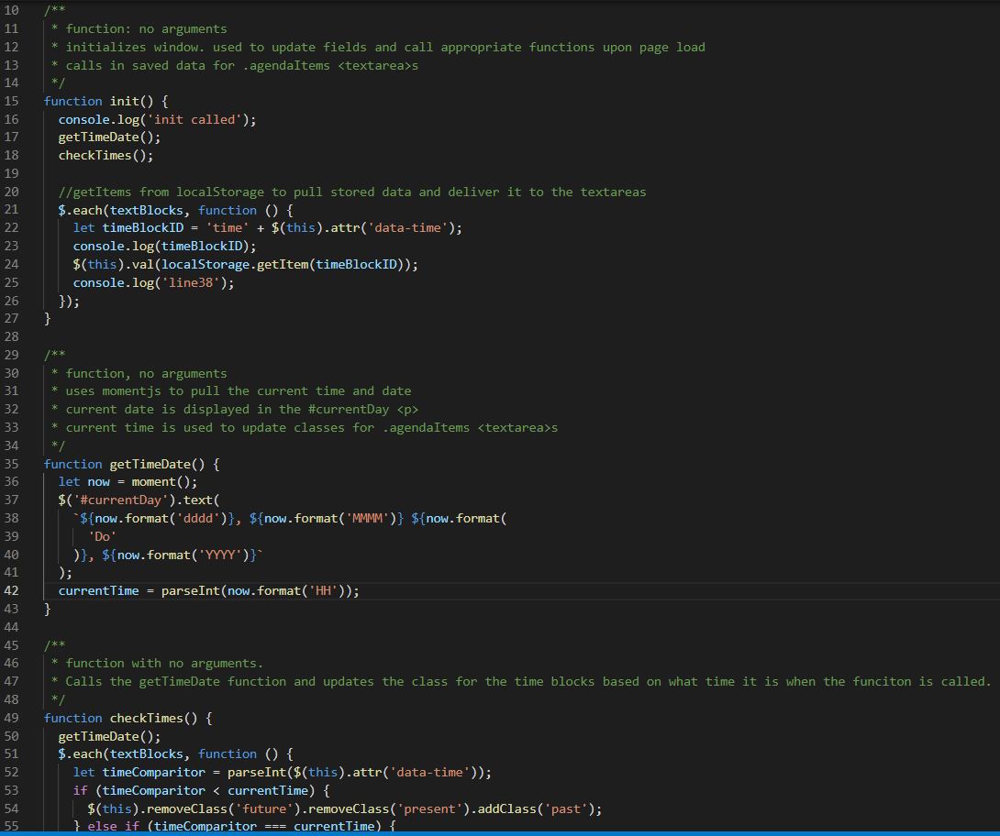

# Work Day Scheduler

## Purpose and Functionality

This application uses jQuery, moment.js, and bootstrap to display a responsive work calendar. The user is able to input text to the schedule, and save the text. The user input is then saved to local storage on their machine so that it is able to be retrieved at a later time.

The application uses moment.js to pull the current date and display that to the page. It also pulls the current time and updates the color of the agenda text areas to represent if the displayed time block is in the past, present, or future.

---

## Key Learnings

- Use of third party APIs (jQuery, momentjs, bootstrap) to develop an application
  - Utilizing API documentation to find correct syntax to call required functionality.
  - Use of jQuery to manipulate DOM elements:
    - change text content of elements
    - add and remove classes from elements
    - read data attributes and use the values in further function execution
    - add event listeners
  - Use of moment.js to execute logic based on current time on the user's system
    - format date to display the current date in a desired format
    - return a number value for the current time for use in further function execution
  - Use of bootstrap to format application using predefined classes with styling
    - identifying correct classes to add to html elements to apply appropriate styling

---

## Deployed Site

The deployed site is hosted on github pages at the following link:

https://aavillanueva6.github.io/workDayScheduler/

---

## Screenshots

The first image is a screenshot of the JavaScript code with a few of the key functions that are included in the application. The second image is a gif that shows a quick demo of the application.

### Image 1 - a section of the JavaScript code

### Application Demo

---

## Known Bugs

- None

---

## Potential Future Improvements

- add functionality for the scheduler to be able to be configured for multiple days, not just the current day.
